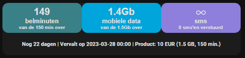

# mobilevikings 

This python script calls the Mobilevikings api and returns the voice, sms & data usage in json format

I use this in Home Assistant (still need to find some time to convert it to a custom component btw)

## Usage
In the script, you need to insert your credentials in the username & password placeholders and you are ready to go.
The script is put in a "scripts"  folder under the /config

I call it as a command line sensor; so add in your sensor configuration the following bit:

```
- platform: command_line
  name: Mobile Vikings
  json_attributes:
    - XXXXXXXXXXXX
  command: "python3 /config/scripts/mobilevikings.py"
  value_template: "{{ value_json['XXXXXXXXXXXX']['data_percentage'] }}"
  scan_interval: 900
  unit_of_measurement: "%"
```
Replace the XXXXXXXXXXXX by the Account Name in Mobile Vikings

## Usages in Home Assistant Lovelace dashboard


